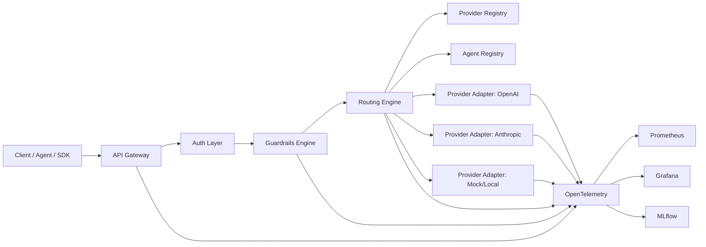

# Astrixa

Astrixa is a security-first LLM gateway and agent platform designed to route requests across multiple providers, stream responses safely, enforce guardrails, and expose deep observability out of the box.

The project target is not a demo-grade proxy. The target is a production-caliber platform with strong isolation boundaries, dynamic control planes, measurable routing behavior, and explicit governance for model usage, agent registration, and operational safety.

## FAANG Bar

Astrixa is being built to a FAANG-level engineering bar:

- security and abuse-resistance are product requirements, not follow-up tasks
- reliability targets are explicit and tested under fault injection
- every critical path is observable with low-cardinality, operator-usable telemetry
- APIs are versioned and contract-driven
- rollout, rollback, and incident handling are designed in from the start
- architecture favors evolvability, isolation, and clear ownership boundaries

## Product Identity

Astrixa should not be a copy of an existing API gateway with LLM labels added on top. Its identity is:

- a security-first AI traffic control plane, not just a provider proxy
- a platform that makes routing decisions explainable and auditable
- an architecture where guardrails, auth, and observability sit inside the request lifecycle
- a system optimized for agent and provider governance, not only request forwarding

Design rule:

- if a feature only improves “API compatibility” but weakens identity, safety, or operator clarity, it is not the default path for Astrixa

## Core Capabilities

- Route LLM traffic across multiple providers and model backends.
- Support streaming responses without breaking client connections.
- Register providers and A2A agents dynamically.
- Enforce security guardrails before and after model invocation.
- Collect logs, traces, metrics, and cost telemetry.
- Run locally and in CI with Docker Compose.

## Guardrails

Guardrails are a first-class platform subsystem in Astrixa, not a post-processing add-on.

Astrixa is designed to:

- evaluate incoming prompts before routing
- detect prompt-injection and obvious secret leakage patterns
- emit structured allow/block verdicts
- make guardrail outcomes visible in telemetry and governance artifacts
- support future response-side sanitization, including suppression of unsafe reasoning leakage

## System Modules

- `api-gateway`: external entrypoint for client and agent traffic.
- `routing-engine`: provider selection, retries, failover, and balancing.
- `provider-registry`: dynamic source of truth for providers and model metadata.
- `agent-registry`: A2A agent catalog with Agent Cards and supported methods.
- `guardrails-engine`: prompt-injection, secret leakage, policy, and content checks.
- `auth-layer`: token validation, service-to-service authn/authz, policy enforcement.
- `telemetry-layer`: OpenTelemetry, Prometheus, Grafana, MLflow integration.
- `provider-adapters`: real and mock connectors for OpenAI, Anthropic, local mocks, and future providers.

## Architecture



## Engineering Goals

- Streaming-safe request proxying.
- Deterministic and explainable routing.
- Fast provider quarantine on health degradation.
- Cost-aware and latency-aware provider selection.
- Auditability for every request path.
- Minimal blast radius for compromised credentials or agents.
- Zero demo-only shortcuts in the core request path.
- Production-ready failure handling, rollback, and operator workflows.

## Delivery Plan

### Level 1

- Docker Compose deployment for all services.
- Mock and optional real LLM providers.
- Real-provider path currently validated with AI Cohort and designed to accept additional OpenAI-compatible providers such as Mistral through env-based registration.
- Basic routing by model name and round robin / weighted routing.
- Streaming passthrough.
- OpenTelemetry instrumentation.
- Prometheus metrics and Grafana dashboards.
- Health endpoints for every service.

### Level 2

- Dynamic provider registry with pricing, limits, priority, and health metadata.
- Agent registry with Agent Cards and discovery APIs.
- Latency-based and health-aware routing.
- Provider ejection and recovery logic.
- TTFT, TPOT, token, and cost telemetry.
- MLflow traces for agent and LLM runs.

### Level 3

- Guardrails for prompt injection, secret leakage, and policy abuse.
- Token-based auth for agents and providers.
- Load, chaos, and resilience testing.
- Security hardening and operational runbooks.

## Repository Conventions

The repository is intentionally being built from a clean slate. We will add code in a way that keeps architecture boundaries explicit from day one.

Planned top-level structure:

```text
.
├── README.md
├── Makefile
├── docker-compose.yml
├── .editorconfig
├── .gitignore
├── docs/
│   ├── adr/
│   ├── architecture/
│   └── api/
├── deploy/
│   ├── compose/
│   ├── grafana/
│   └── prometheus/
├── packages/
│   ├── contracts/
│   ├── telemetry/
│   └── security/
├── services/
│   ├── api-gateway/
│   ├── routing-engine/
│   ├── provider-registry/
│   ├── agent-registry/
│   ├── guardrails-engine/
│   ├── auth-layer/
│   └── provider-adapters/
├── sdk/
├── tests/
│   ├── integration/
│   ├── load/
│   ├── resilience/
│   └── security/
└── scripts/
```

## Security Stance

Astrixa is security-first by default:

- deny-by-default service communication
- explicit provider registration and secret scoping
- request and response policy enforcement
- auditable traces and immutable request metadata
- no silent fail-open behavior for critical controls

The governance baseline is defined in [docs/governance.md](/home/p/astrixa/docs/governance.md).

## Product Direction

The product scope, architecture decisions, phased implementation, and success criteria are defined in [docs/product-proposal.md](/home/p/astrixa/docs/product-proposal.md).

## Delivery Docs

- deployment guide: [docs/deployment.md](/home/p/astrixa/docs/deployment.md)
- testing report: [docs/testing-report.md](/home/p/astrixa/docs/testing-report.md)
- routing strategy comparison: [docs/routing-strategy-comparison.md](/home/p/astrixa/docs/routing-strategy-comparison.md)
- provider outage runbook: [docs/runbook-provider-outage.md](/home/p/astrixa/docs/runbook-provider-outage.md)
- submission checklist: [docs/submission-checklist.md](/home/p/astrixa/docs/submission-checklist.md)
- requirements coverage matrix: [docs/requirements-status.md](/home/p/astrixa/docs/requirements-status.md)

## Immediate Next Steps

1. Create the service skeletons and shared contracts.
2. Define API schemas for gateway, registries, and health endpoints.
3. Stand up Docker Compose with mock providers, Prometheus, Grafana, and OTEL collector.
4. Implement Level 1 streaming proxy and baseline metrics.
5. Add architecture decision records, threat model, and service ownership boundaries.
6. Encode the unique Astrixa control-plane model into contracts and service boundaries.
