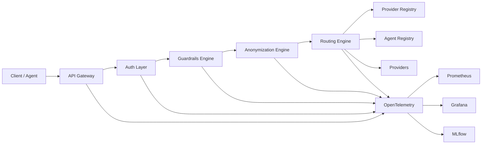

# Astrixa

Astrixa is a containerized multi-provider LLM gateway with agent/provider registries, routing, guardrails, anonymization, authentication, and observability.

## Components

- `api-gateway`: public entrypoint for chat/completions traffic
- `routing-engine`: provider selection and feedback handling
- `provider-registry`: provider metadata, pricing, limits, health state
- `agent-registry`: A2A agent records and auth metadata
- `guardrails-engine`: request and response policy checks
- `anonymization-engine`: local masking and de-anonymization
- `auth-layer`: bearer token validation and agent-scoped auth
- `provider-adapters/mock-llm`: local mock provider
- `mlflow`: run tracking
- `prometheus`, `grafana`, `otel-collector`, `node-exporter`: observability stack

## Request Path

```text
client -> api-gateway -> auth-layer -> guardrails-engine -> anonymization-engine
       -> routing-engine -> provider
       -> response guardrails -> de-anonymization -> client
```

## Capabilities

- multi-provider routing with mock and real providers
- streaming-safe proxying
- dynamic provider registry
- dynamic agent registry
- latency-aware and health-aware routing
- provider ejection and recovery
- ingress and response guardrails
- local anonymization with regex + spaCy NER
- independent `policy_profile` and `anonymization_mode`
- anonymization controls: `on` / `off`, entity include/exclude, restore include/exclude
- agent-scoped policy inheritance
- TTFT, TPOT, token, cost, auth, guardrail, and anonymization metrics
- Prometheus alerting and Grafana dashboards

## Architecture



## Docs

- deployment: [docs/deployment.md](/home/p/astrixa/docs/deployment.md)
- product proposal: [docs/product-proposal.md](/home/p/astrixa/docs/product-proposal.md)
- governance: [docs/governance.md](/home/p/astrixa/docs/governance.md)
- testing report: [docs/testing-report.md](/home/p/astrixa/docs/testing-report.md)
- routing comparison: [docs/routing-strategy-comparison.md](/home/p/astrixa/docs/routing-strategy-comparison.md)
- outage runbook: [docs/runbook-provider-outage.md](/home/p/astrixa/docs/runbook-provider-outage.md)
- requirements matrix: [docs/requirements-status.md](/home/p/astrixa/docs/requirements-status.md)
- submission checklist: [docs/submission-checklist.md](/home/p/astrixa/docs/submission-checklist.md)

## Test Artifacts

- resilience checklist: [tests/resilience/provider-ejection-checklist.md](/home/p/astrixa/tests/resilience/provider-ejection-checklist.md)
- submission suite: [tests/run_submission_suite.py](/home/p/astrixa/tests/run_submission_suite.py)
