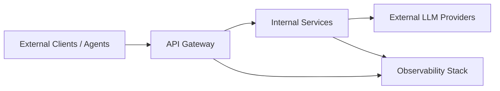

# Astrixa Governance

## Purpose

This document defines the engineering, security, and operational governance baseline for Astrixa. The goal is to keep the platform auditable, secure, and production-ready as it evolves from MVP into a hardened multi-provider AI control plane.

## Governance Principles

- secure by default
- explicit trust boundaries
- least privilege everywhere
- no silent policy bypass
- full request traceability
- measurable operational quality
- backward-compatible evolution by default
- incident readiness as a mandatory engineering concern
- documented ownership for every critical service

## FAANG-Level Governance Standard

Astrixa governance assumes a high operational bar:

- changes to critical paths must be reviewable and justified
- production behavior must be reconstructable from telemetry
- security-sensitive controls require negative tests, not only happy-path tests
- reliability claims require benchmark or resilience evidence
- no core platform feature is considered complete without operator-facing documentation

## Identity Preservation Rules

To keep Astrixa from degenerating into a clone of another platform:

- no single compatibility surface is allowed to define the internal architecture
- provider-specific shortcuts must stay inside adapters
- governance, routing, and guardrails remain explicit subsystems
- control-plane concerns must not be collapsed into env-file configuration
- product identity is preserved through architecture, not branding

## Trust Boundaries

Governance rule:

- External callers never access internal registries directly.
- Only the gateway exposes public endpoints.
- Registry mutation requires authenticated privileged access.
- Provider credentials never leave the adapter boundary.

## Security Controls

### Authentication

- bearer tokens for clients and agents
- separate service tokens for internal service-to-service calls
- token scope must encode allowed actions
- short TTL preferred for machine credentials

### Authorization

- provider registration restricted to operator roles
- agent registration restricted to trusted issuers or operator roles
- routing policy changes restricted to admin roles
- telemetry views can be role-scoped if sensitive cost data is exposed
- break-glass access must be auditable and time-bounded

### Secret Management

- no secrets in source control
- no secrets in container images
- secrets injected through environment or secret store
- provider secrets scoped per adapter, not globally shared
- logs and traces must redact secrets by default

### Guardrails

- all external prompts pass ingress guardrails
- all external prompts can pass anonymization before leaving Astrixa for external providers
- all model responses pass response guardrails before leaving the gateway
- configurable deny/block/quarantine actions
- support detection for prompt injection and secret leakage
- failed guardrails produce auditable events
- guardrail policy version must be attached to request telemetry
- guardrails are a mandatory documented control in Astrixa, not an implementation detail

### Anonymization

- sensitive request data should be masked locally before external LLM calls
- deterministic detectors must handle structured secrets and common PII
- local NER models may enrich masking for names, organizations, and locations
- raw-to-token mappings must stay request-scoped unless a stricter retention policy explicitly allows otherwise
- telemetry must record anonymization counts and policy version, not raw sensitive values
- policy profiles may change restoration behavior, for example `strict` may keep sensitive entities redacted on the response path
- agent-scoped policy profiles should propagate automatically through auth and gateway layers

## Data Governance

### Data Classes

- public operational metadata
- internal routing metadata
- confidential prompts and outputs
- restricted credentials and security events

### Retention

- request metadata retention should be configurable
- raw prompt and response retention must be opt-in
- security events should outlive standard debug logs
- traces should be sampled intelligently but not for blocked critical events

### Redaction

- redact secrets, API keys, tokens, and obvious credentials
- redact policy-sensitive fields in audit exports
- avoid storing full prompt content in metrics labels or high-cardinality fields

## Operational Governance

### Required Endpoints

- `GET /healthz`
- `GET /readyz`
- `GET /metrics`

Every service must expose these endpoints in a consistent way.

### Observability Baseline

Every request path should emit:

- correlation ID
- request counter
- response status
- end-to-end latency
- provider or agent target
- routing decision reason

Advanced telemetry should also emit:

- TTFT
- TPOT
- token counts
- cost estimate
- guardrail verdict
- response-guardrail verdict

### Change Management

- architectural changes require doc updates
- API changes require versioning review
- routing changes require before/after benchmark evidence
- security-sensitive changes require explicit threat review
- changes to metrics names or labels require observability review
- changes to auth, routing, or guardrails require rollback notes

### Release Governance

Before release, the owner must confirm:

- contract compatibility
- migration or config impact
- dashboard and alert impact
- security impact
- rollback procedure

## Reliability Governance

### Failure Policy

- unhealthy providers are ejected from routing pool
- retries must be bounded and observable
- failover must preserve cancellation and stream semantics
- critical policy systems should fail closed, not open
- overload behavior must be explicit, bounded, and measurable

### Performance Policy

- no unbounded buffering of streaming responses
- no high-cardinality labels in Prometheus metrics
- tail latency must be measured and reviewed, not just averages
- routing overhead must stay small relative to provider latency
- resource saturation signals must be available for every stateful or hot-path service

## Testing Governance

Every milestone should include:

- unit tests for routing and guardrails logic
- integration tests for service interactions
- streaming correctness tests
- failure injection tests
- load test reports
- concurrency and cancellation tests for streaming paths
- regression coverage for telemetry and audit fields

Level 3 additionally requires:

- abuse-case tests
- authn/authz negative tests
- provider outage and recovery drills
- secret leakage detection tests

## Documentation Governance

The following documents are mandatory and must stay current:

- root README
- architecture overview
- API contract documentation
- deployment guide
- test report
- routing strategy comparison
- incident/runbook notes for critical services
- threat model and abuse-case catalog
- service ownership and escalation map
- ADRs for any change that affects core platform identity

## Compliance-Oriented Design Rules

- all decisions must be reconstructable from logs and traces
- privileged actions must be attributable
- policy changes must be reviewable
- provider usage and request cost must be measurable

## Decision Log Format

For major technical decisions, add an ADR-like entry containing:

- title
- status
- context
- decision
- consequences
- security impact

## Initial Governance Backlog

1. Define token format and scope model.
2. Define provider registration schema and validation rules.
3. Define guardrail policy schema and severity levels.
4. Define OTEL metric naming and label conventions.
5. Define incident runbook format for provider outage and degraded latency.
6. Define service ownership and on-call expectations.
7. Define ADR template and start the architecture decision log.
