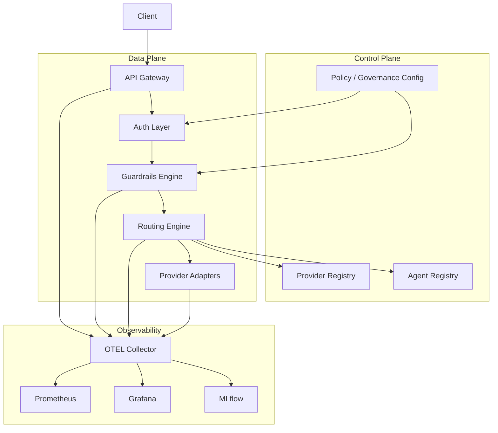

# Astrixa Product Proposal

## Executive Summary

Astrixa is a secure, observable, multi-provider LLM routing platform with agent discovery and policy enforcement. The platform is designed to serve as a hardened control plane and data plane for AI traffic inside serious engineering organizations.

The product differentiator is not only provider abstraction. The differentiator is a combined system that treats AI traffic as a high-risk, high-cost, latency-sensitive production workload and builds routing, safety, and observability as first-class platform features.

## Product Bar

For Astrixa, a high production-grade bar means:

- the architecture must survive real production traffic, not only local demos
- security controls must be enforceable, testable, and fail closed where required
- platform behavior must be measurable under normal load, burst load, and partial failure
- every critical interface must be versioned, documented, and owned
- operational excellence must include SLOs, runbooks, rollback paths, and incident visibility
- design choices must optimize for long-term maintainability, not short-term convenience

## Product Identity And Differentiation

Astrixa is deliberately not positioned as:

- a thin OpenAI-compatible facade
- a generic API aggregator
- a copy of an existing service mesh with prompt fields added

Astrixa is positioned as:

- an AI traffic control plane with explicit trust, routing, and governance boundaries
- a platform where routing is policy-aware, health-aware, and cost-aware by design
- an agent-ready system where provider discovery and agent discovery are first-class primitives
- a platform that treats observability and abuse-resistance as core product behavior

Guardrails are therefore part of the platform identity, because Astrixa is intended to govern AI traffic, not merely relay it.

## Uniqueness Principles

- Guardrails are part of the request graph, not a sidecar afterthought.
- Routing decisions are explainable artifacts, not opaque internal behavior.
- Provider and agent registries are control-plane objects with governance, not config files pretending to be APIs.
- Telemetry is designed for operators and incident response, not only demo dashboards.
- Security policy and routing policy can evolve independently without collapsing service boundaries.

## Problem Statement

Teams integrating LLMs usually hit the same constraints:

- provider lock-in
- unstable latency and availability
- poor cost visibility
- weak auditability
- no safe default handling for prompt injection or secret leakage
- ad hoc agent registration and discovery
- fragmented telemetry across gateway, providers, and agents

Astrixa solves this by introducing a unified gateway with a dynamic registry, routing intelligence, guardrails, and full-stack observability.

## Product Goals

- Provide a single secure endpoint for LLM and A2A traffic.
- Support multiple model providers behind one contract.
- Route requests using explicit, measurable strategies.
- Support streaming end to end.
- Register and discover agents and providers dynamically.
- Enforce guardrails before and after invocation.
- Make every request observable in metrics, logs, and traces.
- Operate cleanly in local, CI, and production-like containerized environments.
- Make security, reliability, and cost controls first-class platform APIs.
- Keep the core data plane simple enough to reason about during incidents.

## Non-Goals

- Training or fine-tuning foundation models.
- Acting as a general-purpose vector database.
- Replacing provider-native policy tooling entirely.
- Building a full workflow engine in the first milestone.
- Shipping a "works on localhost" architecture that cannot evolve safely.

## Users

- Platform engineers running internal AI infrastructure.
- Product teams integrating multiple LLM providers.
- Security teams requiring policy enforcement and auditability.
- Agent builders publishing A2A-compatible services.

## Functional Scope

### Level 1 Scope

- provider connectivity through mock and real adapters
- routing by model and replica selection strategy
- streaming-safe proxying
- baseline health monitoring
- OTEL metrics and traces
- Prometheus and Grafana dashboards
- initial request guardrail enforcement path

### Level 2 Scope

- dynamic provider registry
- dynamic agent registry
- latency-aware and health-aware routing
- provider pool ejection and recovery
- token, cost, TTFT, and TPOT metrics
- MLflow tracing

### Level 3 Scope

- security guardrails
- authorization for agents and providers
- resilience, load, and failure testing
- operational hardening

Note:

- Guardrails exist from the early architecture and runtime path.
- Level 3 expands them into a stronger production policy layer, rather than introducing them from scratch.

## Product Principles

- Security first, never as an afterthought.
- Streaming correctness over simplistic request buffering.
- Explainable routing over black-box heuristics.
- Control-plane clarity and clean API contracts.
- Explicit failure modes and measurable SLOs.
- Strong defaults with minimal operator footguns.
- Backward compatibility and upgrade discipline.
- Operational readiness as part of definition of done.

## Non-Functional Requirements

### Reliability

- All services must expose liveness, readiness, and metrics endpoints.
- Critical request paths must degrade gracefully under provider slowdown or failure.
- Provider failure handling must be deterministic and observable.
- The gateway and registries must start cleanly and fail loudly on misconfiguration.

### Performance

- The gateway must preserve streaming semantics and request cancellation.
- Routing overhead must remain materially smaller than median provider latency.
- No component in the hot path may require full response buffering for streaming APIs.
- Telemetry collection must not materially distort tail latency.

### Security

- All privileged APIs require authentication and authorization.
- Sensitive fields must be redacted from logs, traces, and metrics.
- Policy enforcement points must be explicit in architecture and code.
- High-risk controls such as auth and guardrails must fail closed by default.

### Operability

- Each service must have clear ownership, dashboards, alerts, and runbooks.
- Every routing decision must be inspectable after the fact.
- Releases must support rollback without data-plane ambiguity.
- Load test, resilience test, and abuse test evidence are required before milestone completion.

## Proposed Architecture



## Why This Architecture Is Distinct

The distinctive shape of Astrixa is the split between:

- a hard control plane for provider, agent, and policy state
- a streaming-safe data plane for low-latency request execution
- a governance layer that constrains what routing is even allowed to do

That separation keeps the platform from becoming an undifferentiated proxy with too many responsibilities fused into a single service.

## Ownership Model

- `api-gateway`: ingress, API contract, streaming lifecycle, request identity
- `routing-engine`: provider scoring, retries, failover, circuit logic
- `provider-registry`: provider state, routing metadata, admin API
- `agent-registry`: agent discovery, Agent Card lifecycle, agent metadata validation
- `guardrails-engine`: security policy enforcement and verdict emission
- `telemetry-layer`: OTEL pipeline, metrics taxonomy, dashboards, trace integrity

Each component must have:

- a clear API contract
- a bounded persistence model
- a service owner
- dashboards and alerts
- threat assumptions documented

## Component Responsibilities

### API Gateway

- ingress endpoint for chat, completion, embeddings, and agent calls
- request validation and correlation IDs
- streaming relay and cancellation propagation
- health/readiness endpoints

### Routing Engine

- provider and replica selection
- routing policies by model, provider, tags, health, price, and latency
- retry and failover orchestration
- circuit breaking and temporary provider ejection

### Provider Registry

- CRUD for providers
- provider metadata: base URL, auth mode, models, cost, quotas, priority
- health state cache and last-known routing score

### Agent Registry

- CRUD for A2A agents
- Agent Card storage: name, description, supported methods, auth requirements
- discovery and lookup APIs

### Guardrails Engine

- prompt-injection heuristics and policy checks
- secret detection and outbound leakage prevention
- allow/deny policy evaluation
- request and response annotations for audit

Guardrails must be explicit in docs, code, and runtime topology. They are not optional glue logic.

### Telemetry Layer

- request counters, status codes, p50/p95 latency
- TTFT, TPOT, input/output token counts
- provider selection distribution
- per-request cost estimation
- traces across gateway, routing, guardrails, and provider adapters

### Auth Layer

- API token validation
- service identity for internal calls
- scoped credentials per provider and agent
- role and policy binding

## Architectural Guardrails

- The gateway may orchestrate, but it must not become the permanent home for all business logic.
- Routing logic must remain testable without network access to providers.
- Guardrails must produce machine-readable verdicts, not only human-readable logs.
- Registries must expose explicit APIs rather than hidden file-based config mutation.
- Compatibility shims must not dictate internal architecture.

## Baseline API Surface

### Gateway

- `POST /v1/chat/completions`
- `POST /v1/responses`
- `GET /healthz`
- `GET /readyz`
- `GET /metrics`

### Provider Registry

- `POST /v1/providers`
- `GET /v1/providers`
- `GET /v1/providers/{provider_id}`
- `PATCH /v1/providers/{provider_id}`
- `POST /v1/providers/{provider_id}/disable`
- `POST /v1/providers/{provider_id}/enable`
- `GET /healthz`

### Agent Registry

- `POST /v1/agents`
- `GET /v1/agents`
- `GET /v1/agents/{agent_id}`
- `PATCH /v1/agents/{agent_id}`
- `GET /healthz`

## Example Provider Model

```json
{
  "provider_id": "anthropic-us-east-1",
  "type": "anthropic",
  "base_url": "https://api.anthropic.com",
  "models": ["claude-sonnet-4", "claude-haiku-4"],
  "price": {
    "input_per_1k_tokens": 0.003,
    "output_per_1k_tokens": 0.015
  },
  "priority": 90,
  "weight": 3,
  "limits": {
    "rpm": 1200,
    "tpm": 400000
  },
  "health": {
    "status": "healthy",
    "last_check_at": "2026-04-07T00:00:00Z"
  }
}
```

## Example Agent Card

```json
{
  "agent_id": "security-reviewer",
  "name": "Security Reviewer",
  "description": "Analyzes prompts, policies, and model outputs for security issues.",
  "url": "http://security-reviewer:8080",
  "supported_methods": [
    "agent.invoke",
    "agent.status",
    "agent.health"
  ],
  "auth": {
    "type": "bearer_token"
  }
}
```

## Routing Strategies

### Phase 1

- route by requested model
- select among replicas using round robin or static weights

### Phase 2

- score providers by weighted latency, health, and policy eligibility
- quarantine providers after timeout or repeated 5xx
- use recovery probes for pool re-entry

### Candidate Scoring Formula

```text
score = policy_pass
      * health_factor
      * priority_weight
      * capacity_factor
      * latency_penalty
      * cost_penalty
```

Routing decisions must also emit:

- selected provider
- candidate set size
- rejected candidates with reason categories
- applied strategy version
- failover count

## Security Model

- external traffic terminates at the gateway only
- internal services authenticate each other
- provider secrets are isolated per adapter
- no provider is used unless policy eligible
- sensitive prompts and outputs are tagged for audit
- blocked traffic is logged with redaction

## Threat Model Priorities

- prompt injection against downstream agents or tools
- secret exfiltration through prompts, outputs, or logs
- unauthorized provider registration or routing manipulation
- token replay or stolen service credentials
- observability data leakage
- denial of service via slow streaming or high-cardinality abuse

## Build Strategy

### Phase 0

- define repository skeleton
- define contracts and ADRs
- lock naming, ownership, and API boundaries

### Phase 1

- implement Level 1 routing path with mock providers and telemetry
- preserve architecture seams for registries, auth, and guardrails even before they are fully feature-complete

### Phase 2

- activate dynamic registries and smarter routing
- add richer telemetry and policy enforcement

### Phase 3

- harden auth, guardrails, resilience, and operator workflows

## SLO Candidates

- Gateway availability: 99.9%
- Registry availability: 99.95%
- p95 internal routing overhead: under 100 ms excluding provider latency
- provider failover decision after unhealthy detection: under 30 s
- telemetry completeness for successful requests: 99%+

## Release Readiness Criteria

No milestone is complete unless all of the following exist:

- architecture and API docs updated
- health/readiness behavior verified
- dashboards and key alerts configured
- integration tests passing
- resilience test evidence recorded
- known risks and rollback plan documented

## Test Strategy

### Functional

- request validation
- streaming passthrough
- provider and agent CRUD
- retry/failover correctness

### Performance

- sustained concurrency
- burst traffic
- provider degradation
- slow-streaming providers

### Security

- prompt-injection attempts
- secret exfiltration patterns
- unauthorized provider registration
- token misuse and replay

## Deployment Strategy

### Local Development

- Docker Compose
- mock providers by default
- optional real provider adapters behind env flags

### Production-Oriented Next Step

- Kubernetes deployment
- external secret manager
- service mesh or mTLS-aware ingress
- autoscaling on request and latency metrics

## Deliverables

- architecture diagrams
- API specs
- run and deployment guides
- testing reports
- routing strategy comparison reports
- security and governance documentation

## Acceptance Criteria

- End-to-end request reaches correct provider and streams back to client.
- Metrics show request count, status, latency, and provider distribution.
- Registries support runtime changes without restart.
- Health-aware routing excludes failing providers automatically.
- Guardrails can block unsafe requests deterministically.
- Containerized stack boots consistently with one Compose command.
- The system has enough telemetry and documentation for an on-call engineer to debug routing and failure behavior without source-diving first.
